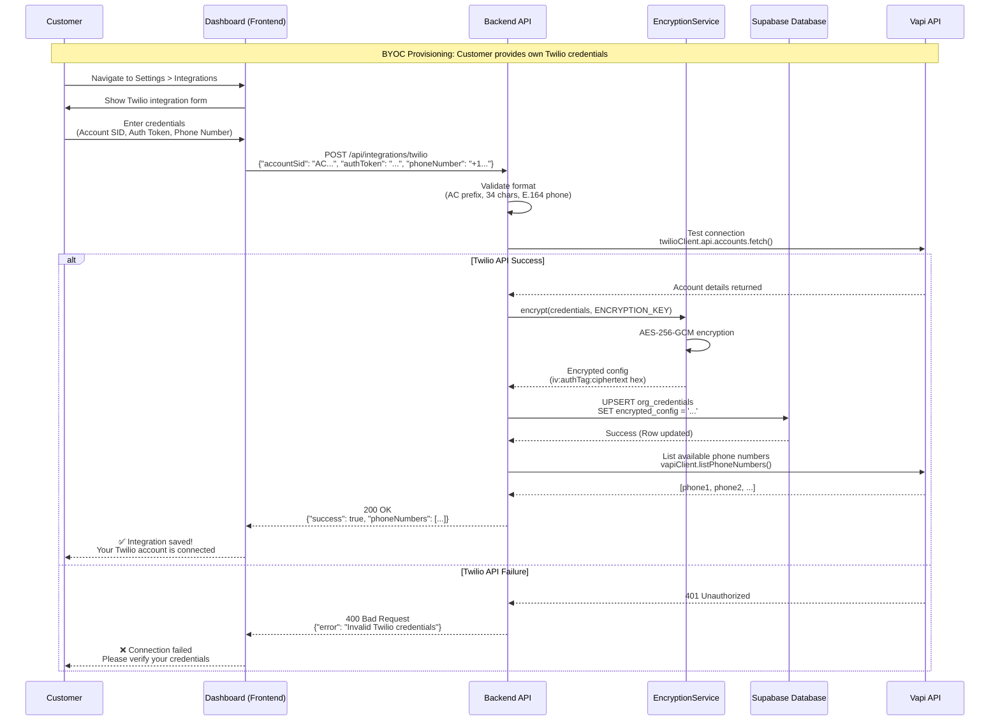
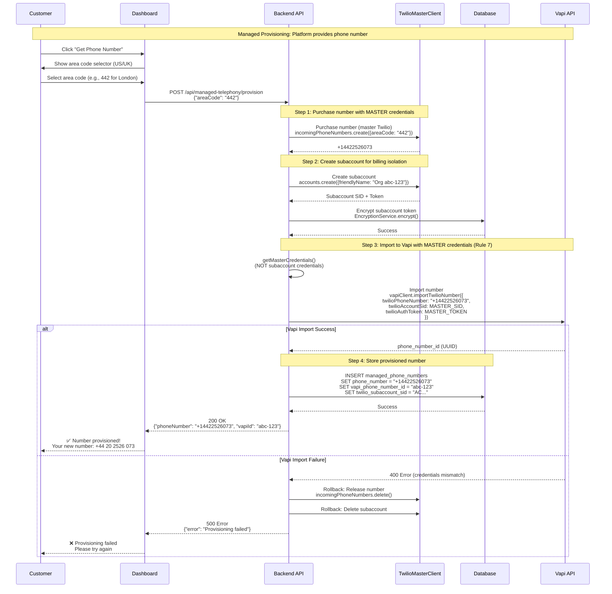
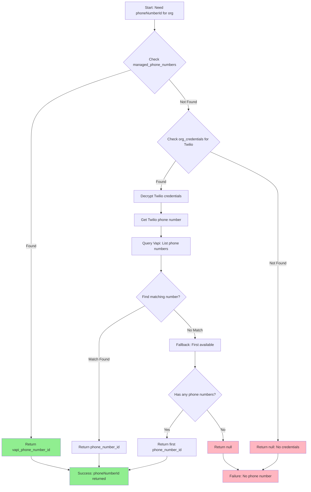

# Provisioning Flows & Credential Management

**Purpose:** Visual documentation of all provisioning flows, credential hierarchies, and data pipelines
**Status:** Complete - Production Reference
**Last Updated:** February 9, 2026

---

## Table of Contents

1. [BYOC Provisioning Flow](#byoc-provisioning-flow)
2. [Managed Telephony Provisioning Flow](#managed-telephony-provisioning-flow)
3. [Credential Resolution Chain](#credential-resolution-chain)
4. [Encryption/Decryption Pipeline](#encryptiondecryption-pipeline)
5. [API Endpoint Reference](#api-endpoint-reference)

---

## BYOC Provisioning Flow

**BYOC (Bring Your Own Carrier):** Customer provides their own Twilio credentials

### Sequence Diagram



### Step-by-Step Process

**Step 1: User Input**
- Customer navigates to **Settings > Integrations**
- Selects "Connect Twilio Account"
- Enters 3 credentials:
  - **Account SID** (e.g., `AC_EXAMPLE_ACCT_SID`)
  - **Auth Token** (e.g., `0123456789abcdef0123456789abcdef`)
  - **Phone Number** (e.g., `+12125551234`)

**Step 2: Frontend Validation**
- Check Account SID starts with `AC` and is 34 characters
- Check Auth Token is 32 characters
- Check Phone Number is E.164 format (`+1234567890`)
- If invalid, show error before sending to backend

**Step 3: Backend API Call**
```http
POST /api/integrations/twilio HTTP/1.1
Host: backend.voxanne.ai
Authorization: Bearer <JWT>
Content-Type: application/json

{
  "accountSid": "AC_EXAMPLE_ACCT_SID",
  "authToken": "0123456789abcdef0123456789abcdef",
  "phoneNumber": "+12125551234"
}
```

**Step 4: Backend Validation & Test**
```typescript
// backend/src/routes/integrations-byoc.ts
const twilioClient = require('twilio')(accountSid, authToken);

try {
  // Test connection by fetching account details
  await twilioClient.api.accounts(accountSid).fetch();
  // Success - credentials valid
} catch (error) {
  // Failure - credentials invalid
  return res.status(400).json({ error: 'Invalid Twilio credentials' });
}
```

**Step 5: Encrypt Credentials**
```typescript
// backend/src/services/encryption.ts
const plaintext = JSON.stringify({
  accountSid,
  authToken,
  phoneNumber
});

const encrypted = EncryptionService.encrypt(plaintext);
// Returns: "a1b2c3d4e5f6:g7h8i9j0k1l2:m3n4o5p6q7r8..." (hex)
```

**Step 6: Store in Database**
```sql
-- Supabase org_credentials table
INSERT INTO org_credentials (org_id, provider, encrypted_config)
VALUES (
  '46cf2995-2bee-44e3-838b-24151486fe4e',
  'twilio',
  'a1b2c3d4e5f6:g7h8i9j0k1l2:m3n4o5p6q7r8...'
)
ON CONFLICT (org_id, provider)
DO UPDATE SET encrypted_config = EXCLUDED.encrypted_config;
```

**Step 7: List Vapi Phone Numbers**
```typescript
// backend/src/services/vapi-client.ts
const vapiPhones = await vapiClient.listPhoneNumbers();
// Returns: [{ id: 'abc-123', number: '+12125551234' }, ...]
```

**Step 8: Return Success**
```json
{
  "success": true,
  "message": "Twilio account connected successfully",
  "phoneNumbers": [
    { "id": "abc-123", "number": "+12125551234" }
  ]
}
```

---

## Managed Telephony Provisioning Flow

**Managed Telephony:** Platform provisions phone numbers for customer (reseller model)

### Sequence Diagram



### Step-by-Step Process

**Step 1: User Initiates Provisioning**
- Customer clicks "Get Phone Number" in dashboard
- Selects country and area code:
  - **US:** 212 (New York), 415 (San Francisco), etc.
  - **UK:** 20 (London), 121 (Birmingham), etc.

**Step 2: Purchase Number with Master Account**
```typescript
// backend/src/services/managed-telephony-service.ts
const masterClient = getMasterClient(); // Uses TWILIO_MASTER_* credentials

const number = await masterClient.incomingPhoneNumbers.create({
  areaCode: '442', // UK London
  friendlyName: `Voxanne-Managed-${orgId}`,
  voiceUrl: `${BACKEND_URL}/api/webhooks/vapi`
});

// Result: number.phoneNumber = '+14422526073'
```

**Step 3: Create Subaccount for Billing Isolation**
```typescript
const subaccount = await masterClient.api.accounts.create({
  friendlyName: `Org ${orgId}`,
});

// Result: subaccount.sid = 'AC84ac51...'
// Result: subaccount.authToken = 'bcd34dc74f...'
```

**Step 4: Encrypt and Store Subaccount Token**
```typescript
const encrypted = EncryptionService.encrypt(
  JSON.stringify({
    subaccountSid: subaccount.sid,
    subaccountToken: subaccount.authToken
  })
);

await supabase.from('twilio_subaccounts').insert({
  org_id: orgId,
  subaccount_sid: subaccount.sid,
  twilio_auth_token_encrypted: encrypted
});
```

**Step 5: Import to Vapi with MASTER Credentials (Rule 7)**
```typescript
// ⚠️ CRITICAL: Use MASTER credentials (not subaccount)
const masterCreds = getMasterCredentials();

const vapiPhone = await vapiClient.importTwilioNumber({
  twilioPhoneNumber: number.phoneNumber,
  twilioAccountSid: masterCreds.accountSid, // ✅ MASTER SID
  twilioAuthToken: masterCreds.authToken     // ✅ MASTER TOKEN
});

// If using subaccount credentials here, import FAILS (Rule 7)
```

**Step 6: Store Provisioned Number**
```sql
INSERT INTO managed_phone_numbers (
  org_id,
  phone_number,
  vapi_phone_number_id,
  twilio_subaccount_sid,
  status,
  provisioned_at
) VALUES (
  '46cf2995-2bee-44e3-838b-24151486fe4e',
  '+14422526073',
  'abc-123-def-456',
  'AC_EXAMPLE_ACCT_SID',
  'active',
  NOW()
);
```

**Step 7: Link to Agent**
```sql
UPDATE agents
SET vapi_phone_number_id = 'abc-123-def-456'
WHERE org_id = '46cf2995-2bee-44e3-838b-24151486fe4e'
  AND call_direction = 'inbound';
```

---

## Credential Resolution Chain

**Purpose:** Resolve Vapi phone number UUID from organization ID

### Flowchart



### Resolution Logic

**Step 0: Check Managed Phone Numbers First (Short-Circuit)**
```typescript
// backend/src/services/phone-number-resolver.ts
const { data: managedPhone } = await supabase
  .from('managed_phone_numbers')
  .select('vapi_phone_number_id')
  .eq('org_id', orgId)
  .eq('status', 'active')
  .maybeSingle();

if (managedPhone) {
  return managedPhone.vapi_phone_number_id; // ✅ Short-circuit for managed orgs
}
```

**Step 1: Get Twilio Phone from BYOC Credentials**
```typescript
const twilioCredentials = await IntegrationDecryptor.getTwilioCredentials(orgId);

if (!twilioCredentials) {
  return null; // ❌ No credentials configured
}

const twilioPhone = twilioCredentials.phoneNumber; // e.g., '+12125551234'
```

**Step 2: List Vapi Phone Numbers**
```typescript
const vapiPhones = await vapiClient.listPhoneNumbers();
// Returns: [
//   { id: 'abc-123', number: '+12125551234' },
//   { id: 'def-456', number: '+14155551234' }
// ]
```

**Step 3: Find Matching Number**
```typescript
const matchingPhone = vapiPhones.find(p => p.number === twilioPhone);

if (matchingPhone) {
  return matchingPhone.id; // ✅ Match found
}
```

**Step 4: Fallback to First Available**
```typescript
if (vapiPhones.length > 0) {
  return vapiPhones[0].id; // ⚠️ Fallback to first available
}

return null; // ❌ No phone numbers available
```

---

## Encryption/Decryption Pipeline

**Purpose:** Secure storage of tenant credentials in database

### Encryption Flow

```mermaid
graph LR
    A[User Input:<br/>Plaintext Credentials] --> B[JSON.stringify]
    B --> C[EncryptionService.encrypt]
    C --> D[AES-256-GCM<br/>Algorithm]
    D --> E[Generate Random IV<br/>12 bytes]
    E --> F[Encrypt Plaintext]
    F --> G[Generate Auth Tag<br/>16 bytes]
    G --> H[Combine:<br/>iv:authTag:ciphertext]
    H --> I[Hex Encoding]
    I --> J[Store in Database:<br/>org_credentials.encrypted_config]

    style A fill:#FFE4B5
    style J fill:#90EE90
    style D fill:#87CEEB
```



**Encryption Example:**
```typescript
// Input
const plaintext = JSON.stringify({
  accountSid: 'AC_EXAMPLE_ACCT_SID',
  authToken: '490bd1cbcef733be829e7efd06291c09',
  phoneNumber: '+12125551234'
});

// Encryption
const encrypted = EncryptionService.encrypt(plaintext);

// Output (hex string)
"a1b2c3d4e5f6g7h8i9j0:k1l2m3n4o5p6q7r8s9t0:u1v2w3x4y5z6a7b8c9d0..."
//      ↑ IV (12 bytes)          ↑ Auth Tag (16 bytes)    ↑ Ciphertext
```

### Decryption Flow


**Decryption Example:**
```typescript
// Input (from database)
const encrypted = "a1b2c3d4e5f6g7h8i9j0:k1l2m3n4o5p6q7r8s9t0:u1v2w3x4y5z6a7b8c9d0...";

// Decryption
const plaintext = EncryptionService.decrypt(encrypted);

// Output (JSON string)
"{\"accountSid\":\"ACbd0c...\",\"authToken\":\"490bd1...\",\"phoneNumber\":\"+1212...\"}"

// Parse
const credentials = JSON.parse(plaintext);

// Result: TwilioCredentials object
{
  accountSid: 'AC_EXAMPLE_ACCT_SID',
  authToken: '490bd1cbcef733be829e7efd06291c09',
  phoneNumber: '+12125551234'
}
```

---

## API Endpoint Reference

### BYOC Endpoints

| Method | Endpoint | Purpose | Auth Required |
|--------|----------|---------|---------------|
| POST | `/api/integrations/twilio` | Save Twilio credentials | ✅ JWT |
| GET | `/api/integrations/twilio` | Get masked Twilio config | ✅ JWT |
| GET | `/api/integrations/vapi/numbers` | List Vapi phone numbers | ✅ JWT |
| POST | `/api/integrations/vapi/assign-number` | Assign number to agent | ✅ JWT |
| GET | `/api/integrations/status` | Check all integrations | ✅ JWT |
| POST | `/api/integrations/:provider/verify` | Test credential connection | ✅ JWT |
| DELETE | `/api/integrations/:provider` | Disconnect integration | ✅ JWT |
| GET | `/api/integrations/telephony-mode` | Get current mode + status | ✅ JWT |

### Managed Telephony Endpoints

| Method | Endpoint | Purpose | Auth Required |
|--------|----------|---------|---------------|
| POST | `/api/managed-telephony/provision` | One-click number provisioning | ✅ JWT |
| DELETE | `/api/managed-telephony/numbers/:phoneNumber` | Release managed number | ✅ JWT |
| GET | `/api/managed-telephony/status` | Current managed telephony state | ✅ JWT |
| POST | `/api/managed-telephony/switch-mode` | Switch between byoc/managed | ✅ JWT |
| GET | `/api/managed-telephony/available-numbers` | Search without purchasing | ✅ JWT |
| POST | `/api/managed-telephony/a2p/register-brand` | A2P brand registration | ✅ JWT |
| POST | `/api/managed-telephony/a2p/register-campaign` | A2P campaign registration | ✅ JWT |

### Example API Calls

**Save Twilio Credentials (BYOC):**
```bash
curl -X POST http://localhost:3001/api/integrations/twilio \
  -H "Authorization: Bearer <JWT>" \
  -H "Content-Type: application/json" \
  -d '{
    "accountSid": "AC_EXAMPLE_ACCT_SID",
    "authToken": "490bd1cbcef733be829e7efd06291c09",
    "phoneNumber": "+12125551234"
  }'
```

**Provision Managed Number:**
```bash
curl -X POST http://localhost:3001/api/managed-telephony/provision \
  -H "Authorization: Bearer <JWT>" \
  -H "Content-Type: application/json" \
  -d '{
    "areaCode": "442",
    "country": "GB"
  }'
```

**Get Integration Status:**
```bash
curl -X GET http://localhost:3001/api/integrations/status \
  -H "Authorization: Bearer <JWT>"
```

**Expected Response:**
```json
{
  "twilio": {
    "connected": true,
    "phoneNumber": "+1212*****34",
    "lastVerified": "2026-02-09T10:30:00Z"
  },
  "googleCalendar": {
    "connected": true,
    "email": "user@example.com",
    "lastVerified": "2026-02-09T09:15:00Z"
  },
  "vapi": {
    "connected": true,
    "phoneNumbers": 1,
    "lastVerified": "2026-02-09T10:28:00Z"
  }
}
```

---

## Troubleshooting Guide

### Common Issues

**Issue 1: "Vapi import failed - credentials mismatch"**
- **Cause:** Using subaccount credentials instead of master credentials (Rule 7 violated)
- **Fix:** Use `getMasterCredentials()` for Vapi imports
- **Reference:** CONFIGURATION_CRITICAL_INVARIANTS.md (Rule 7)

**Issue 2: "No phone number available for organization"**
- **Cause:** `vapi_phone_number_id` is NULL and resolver can't find match
- **Fix:** Re-save agent configuration or provision managed number
- **Reference:** CONFIGURATION_CRITICAL_INVARIANTS.md (Rule 4)

**Issue 3: "Failed to decrypt credentials"**
- **Cause:** ENCRYPTION_KEY changed or incorrect
- **Fix:** Restore correct ENCRYPTION_KEY from backup
- **Reference:** CONFIGURATION_CRITICAL_INVARIANTS.md (Section 3)

**Issue 4: "Twilio authentication failed"**
- **Cause:** Invalid Twilio credentials (wrong Account SID or Auth Token)
- **Fix:** Verify credentials at https://console.twilio.com
- **Reference:** Run `npm run validate-env` to test connection

---

**END OF DOCUMENT**

**Version:** 1.0.0
**Last Updated:** February 9, 2026
**Next Review:** March 9, 2026
