# 🔌 Vapi API Integration Verification

**Purpose**: Verify Vapi assistant is correctly configured with your booking tool  
**Difficulty**: Moderate  
**Time Required**: 10 minutes

---

## Quick Verification Flow

```mermaid
graph LR
    A["🎤 Vapi Assistant"] -->|"POST /api/tools/update"| B["Your Backend"]
    B -->|"Book Appointment"| C["📊 Supabase"]
    C -->|"✅ Confirmed"| D["🎯 AI Response"]
```



---

## Part 1: Verify Vapi Assistant Configuration

### Step 1: Get Your Vapi Assistant ID

```bash
# Set your Vapi PRIVATE KEY (backend master key - stored in backend/.env as VAPI_PRIVATE_KEY)
export VAPI_PRIVATE_KEY="your-vapi-private-key"

# Get list of assistants
curl -X GET "https://api.vapi.ai/assistant" \
  -H "Authorization: Bearer $VAPI_PRIVATE_KEY" | jq .

# Expected Response:
# {
#   "assistants": [
#     {
#       "id": "assistant-id-123",
#       "name": "Clinic Booking AI",
#       "model": "gpt-4",
#       ...
#     }
#   ]
# }

# Copy the assistant ID for next steps
export VAPI_ASSISTANT_ID="assistant-id-123"

# NOTE: VAPI_PRIVATE_KEY is the backend's MASTER KEY (stored in backend/.env)
# All organizations share this single key - tools are registered globally
# Per PRD: "Backend is the sole Vapi provider for all multi-tenant organizations"
```

### Step 2: Verify Tool Is Registered

```bash
# Get assistant details
curl -X GET "https://api.vapi.ai/assistant/$VAPI_ASSISTANT_ID" \
  -H "Authorization: Bearer $VAPI_PRIVATE_KEY" | jq .

# Look for the "tools" array - should contain "bookClinicAppointment"
# Expected output section:
# {
#   "id": "assistant-id-123",
#   "name": "Clinic Booking AI",
#   "tools": [
#     {
#       "id": "tool-booking",
#       "name": "bookClinicAppointment",
#       "type": "function",
#       "function": {
#         "name": "bookClinicAppointment",
#         "description": "Books a clinic appointment",
#         "parameters": {
#           "type": "object",
#           "properties": {
#             "patientName": { "type": "string" },
#             "patientPhone": { "type": "string" },
#             "patientEmail": { "type": "string" },
#             "appointmentDate": { "type": "string" },
#             "appointmentTime": { "type": "string" }
#           },
#           "required": ["patientName", "patientPhone", "patientEmail", "appointmentDate", "appointmentTime"]
#         }
#       },
#       "server": {
#         "url": "https://your-backend.com/api/vapi/tools",
#         "timeoutSeconds": 30
#       }
#     }
#   ]
# }

# Success Criteria:
# ✅ Tool named "bookClinicAppointment" exists
# ✅ All 5 required parameters listed
# ✅ Server URL points to your backend
# ✅ Server URL is HTTPS (secure)
```

### Step 3: Verify Tool Server Endpoint

```bash
# Test that Vapi can reach your backend
curl -X POST "https://api.vapi.ai/assistant/$VAPI_ASSISTANT_ID/test" \
  -H "Authorization: Bearer $VAPI_PRIVATE_KEY" \
  -H "Content-Type: application/json" \
  -d '{
    "toolName": "bookClinicAppointment",
    "arguments": {
      "patientName": "John Doe",
      "patientPhone": "+15555555555",
      "patientEmail": "john@example.com",
      "appointmentDate": "2026-08-20",
      "appointmentTime": "14:00"
    }
  }' | jq .

# Expected Response (success):
# {
#   "success": true,
#   "result": {
#     "appointmentId": "apt-123-def",
#     "message": "Appointment confirmed"
#   }
# }

# Expected Response (failure - endpoint not reachable):
# {
#   "success": false,
#   "error": "Failed to reach server: Connection refused"
# }

# Success Criteria:
# ✅ Response is JSON
# ✅ success: true (or appropriate error if expected)
# ✅ No timeout errors
```

---

## Part 2: Verify Tool Parameters Match Backend

### Check Parameter Mapping

Your backend expects:
```typescript
{
  "toolCallId": "call-id",
  "tool": {
    "arguments": {
      "organizationId": "org-id",      // ← IMPORTANT: From JWT token
      "patientName": "string",
      "patientPhone": "string",
      "patientEmail": "string",
      "appointmentDate": "YYYY-MM-DD",
      "appointmentTime": "HH:MM"
    }
  }
}
```

Vapi tool definition should have:
```json
{
  "properties": {
    "patientName": { "type": "string", "description": "Patient's full name" },
    "patientPhone": { "type": "string", "description": "Phone in +1 format" },
    "patientEmail": { "type": "string", "description": "Patient email" },
    "appointmentDate": { "type": "string", "description": "Date in YYYY-MM-DD format" },
    "appointmentTime": { "type": "string", "description": "Time in HH:MM 24-hour format" }
  },
  "required": ["patientName", "patientPhone", "patientEmail", "appointmentDate", "appointmentTime"]
}
```

---

## Part 3: Test Tool Execution During Call

### Setup Test Environment

```bash
# Terminal 1: Watch backend logs
tail -f /var/log/backend.log | grep -E "vapi|booking|tool"

# Terminal 2: Watch Vapi logs (if available)
# Contact Vapi support or check dashboard for real-time logs

# Terminal 3: Start test
```

### Make Test Call

1. **Call your Vapi-enabled phone number**
   ```
   Patient: "Hi, I'd like to book an appointment"
   AI: "I'd be happy to help! What's your name?"
   Patient: "John Doe"
   AI: "And what's the best phone number to reach you?"
   Patient: "+15551234567"
   ...
   ```

2. **Listen for booking confirmation**
   ```
   AI: "Great! I've booked your appointment for 
        [date] at [time]. You should receive a 
        confirmation shortly."
   ```

3. **Verify in logs**
   ```bash
   # Check backend logs for:
   # - "Tool call received: bookClinicAppointment"
   # - "Booking created: apt-123-def"
   # - "Patient: John Doe"
   # - No error messages
   ```

4. **Verify in database**
   ```bash
   # Check Supabase
   psql "postgresql://..." -c "
     SELECT 
       id, 
       name, 
       phone, 
       email, 
       scheduled_at,
       created_at
     FROM appointments 
     WHERE name = 'John Doe'
     ORDER BY created_at DESC
     LIMIT 1;"
   
   # Expected output:
   # id         | name     | phone           | email              | scheduled_at
   # ───────────┼──────────┼─────────────────┼────────────────────┼──────────────────
   # apt-123... | John Doe | +15551234567    | john@example.com   | 2026-08-20 14:00
   ```

---

## Part 4: Verify Authentication & Security

### Check JWT Token Handling

```bash
# Verify your backend validates Vapi API key
grep -n "VAPI_API_KEY\|verifyVapiRequest\|validateVapiToken" \
  backend/src/routes/vapi-tools-routes.ts

# Should show:
# - JWT validation middleware
# - Organization ID extraction from token
# - API key verification
```

### Verify HTTPS & TLS

```bash
# Test endpoint is HTTPS
curl -I https://your-backend.com/api/vapi/tools/bookClinicAppointment

# Expected:
# HTTP/2 200 
# Server: nginx
# X-Frame-Options: DENY

# If you see "insecure" or "http://" without https:
# ❌ CRITICAL: Switch to HTTPS before production
```

---

## Part 5: Troubleshooting Common Issues

### Issue 1: Tool Not Found in Vapi

**Error in logs**: "Tool 'bookClinicAppointment' not found"

**Solution**:
```bash
# 1. Verify tool is registered
curl -X GET "https://api.vapi.ai/assistant/$VAPI_ASSISTANT_ID" \
  -H "Authorization: Bearer $VAPI_PRIVATE_KEY" | \
  jq '.tools[] | select(.function.name=="bookClinicAppointment")'

# 2. If not found, register it via backend
# Backend's ToolSyncService handles this automatically on agent save

# 3. Restart AI assistant
curl -X POST "https://api.vapi.ai/assistant/$VAPI_ASSISTANT_ID/restart" \
  -H "Authorization: Bearer $VAPI_PRIVATE_KEY"
```

### Issue 2: Tool Call Timeout

**Error in logs**: "Tool call timed out after 30 seconds"

**Solution**:
```bash
# 1. Check backend is running
curl http://localhost:3001/health

# 2. Check network latency
ping -c 4 your-backend.com

# 3. Verify Vapi can reach your server
curl -X POST "https://api.vapi.ai/assistant/$VAPI_ASSISTANT_ID/test" \
  -H "Authorization: Bearer $VAPI_API_KEY" \
  -d '{"toolName":"bookClinicAppointment",...}'

# 4. Increase timeout in Vapi dashboard if needed
# (Usually not necessary - 30s is standard)
```

### Issue 3: Tool Returns Error

**Error in logs**: "Tool call failed: INVALID_INPUT"

**Solution**:
```bash
# 1. Check parameter format
# Vapi sends: { "patientName": "John", "patientPhone": "+15551234567" }
# Backend expects: Same format

# 2. Verify data types
echo '{"patientName":"John","patientPhone":"+15551234567"}' | \
  curl -X POST http://localhost:3001/api/vapi/tools/bookClinicAppointment \
    -H "Content-Type: application/json" \
    -d @- | jq .

# 3. Check data normalization
# Is phone being converted to E.164 format?
# Is email being lowercased?
# Is name being title-cased?
```

### Issue 4: Assistant Doesn't Call Tool

**Problem**: AI is running but not calling the booking tool

**Solution**:
```bash
# 1. Check assistant prompt includes tool usage instructions
curl -X GET "https://api.vapi.ai/assistant/$VAPI_ASSISTANT_ID" \
  -H "Authorization: Bearer $VAPI_API_KEY" | \
  jq '.systemPrompt'

# 2. Ensure prompt instructs AI to use bookClinicAppointment tool
# Example: "When a patient requests a booking, use the bookClinicAppointment tool"

# 3. Test with explicit instruction
# Call and say: "I want to book an appointment for tomorrow at 2 PM"
# (More specific than "Hi")

# 4. Check model can handle function calling
# Should be gpt-4 or gpt-4-turbo (not gpt-3.5)
```

---

## Part 6: Performance Monitoring

### Monitor Tool Call Success Rate

```bash
# Dashboard query: Count successful vs failed tool calls (last 24h)
SELECT 
  DATE_TRUNC('hour', created_at) as hour,
  status,
  COUNT(*) as count
FROM vapi_tool_calls
WHERE created_at > NOW() - INTERVAL '24 hours'
GROUP BY hour, status
ORDER BY hour DESC;

# Expected:
# hour                  | status  | count
# ──────────────────────┼─────────┼───────
# 2026-01-18 19:00:00   | success | 48
# 2026-01-18 19:00:00   | failed  | 2
# ...

# Success Rate Target: >95%
# Current Rate = 48 / (48 + 2) = 96% ✅
```

### Monitor Response Times

```bash
# Check average tool call duration
SELECT 
  PERCENTILE_CONT(0.5) WITHIN GROUP (ORDER BY duration_ms) as p50,
  PERCENTILE_CONT(0.95) WITHIN GROUP (ORDER BY duration_ms) as p95,
  PERCENTILE_CONT(0.99) WITHIN GROUP (ORDER BY duration_ms) as p99,
  MAX(duration_ms) as max
FROM vapi_tool_calls
WHERE created_at > NOW() - INTERVAL '24 hours';

# Expected:
# p50  | p95  | p99  | max
# ─────┼──────┼──────┼────
# 120  | 250  | 350  | 500

# Performance Targets:
# ✅ P50: <150ms
# ✅ P95: <300ms
# ✅ P99: <500ms
# ✅ Max: <1000ms
```

---

## Part 7: Security Checklist

Before deploying tool to production, verify:

- [ ] **API Key** is stored in `.env` (not hardcoded)
- [ ] **HTTPS/TLS** enabled on backend endpoint
- [ ] **JWT Token Validation** active in middleware
- [ ] **Rate Limiting** configured (prevent abuse)
- [ ] **Input Validation** (phone, email, date formats)
- [ ] **Org ID Isolation** (can't book for other orgs)
- [ ] **Timeout** set to 30s (default)
- [ ] **Error Logging** doesn't expose sensitive data
- [ ] **Monitor API Usage** in Vapi dashboard
- [ ] **Backup Method** if tool fails (fallback to manual)

---

## Summary

| Component | Check | Status |
|-----------|-------|--------|
| **Vapi Assistant** | Exists and is active | [ ] |
| **Tool Registration** | bookClinicAppointment registered | [ ] |
| **Parameters** | All 5 required params defined | [ ] |
| **Server URL** | HTTPS, reachable, times out properly | [ ] |
| **JWT Validation** | Org ID extracted correctly | [ ] |
| **Live Call** | Booking created in database | [ ] |
| **Performance** | <300ms response time | [ ] |
| **Security** | API keys protected, HTTPS enforced | [ ] |

**All checks passing?** ✅ Ready for production deployment

---

**Generated**: 2026-01-18  
**Status**: Ready for verification
